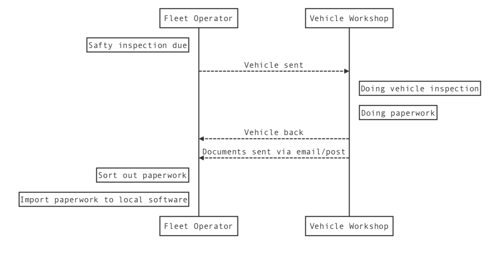

#  Vehicle Testing Report Exchange Standard
Current market offer a lot of software helping to manage vehicle workshops from another side you can find a lot of software to manage fleet
and this two sites need to talk to each another in terms of scheduling services like vehicle inspection, and they need to share documents between each other.

Standard communication between fleet operator and vehicle workshop \
*FMS - Fleet Management Software

A lot of software providers build solutions suitable for them and do not following any standards as a result implementations are not compatible and can't share information between systems automatically.
#### Our goal for this project

 - Build secure simple to implement communication standard to allow share information automatically between fleet operators and vehicle workshops
 - Keep implementation lean and simple
 - Be able to communicate with any FMS certificated by "Fleet Software Exchange Standards"

## Communication and transportation channel
All communication need to be done via https protocol using JSON secured by JWT token

## Certificate
LOGO \
when you see this logo it means product is compatible with "Fleet Software Exchange Standards" and software can exchange information between any other software where this logo appears. [To find out certificated software please visit this page ](./certificated-software/README.md)

 ## Certification Path
 Our certification path is very easy \
 To be able to display our "Fleet Software Exchange Standards" logo on your product your software need to meet our acceptance criteria and pass all postman tests.
 Acceptance criteria and tests are divided on two groups. First group is designed for Fleet management software the second group is designed for vehicle workshops software. \
 If you need any help please contact our team and we will help you with this process. <team@techowls.co.uk>

 ### Acceptance criteria
 ### Postman test
