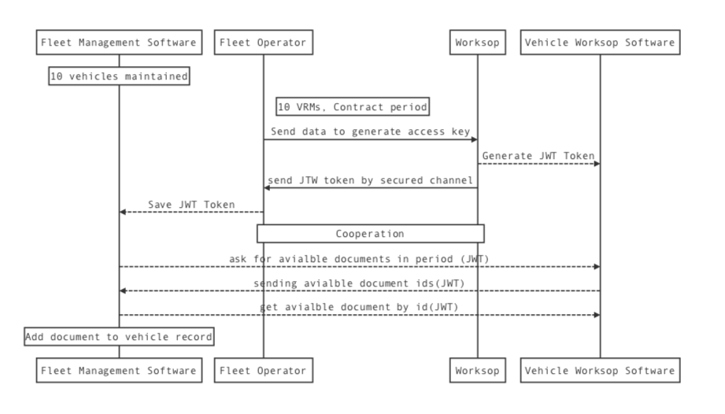

#  Markup Language - for vehicle documents exchange
Current market offer a lot of software helping to:
- Manage a fleet (FM)
- Manage workshops or garages (WG)
- Manage renting or leasing vehicles (RL)
- Manage vehicles for sale (SM) \

When business work together they need share documents between each other for example: \

- HDV/PSV operators to meet DVSA compliance requirements need to receive and store safety inspection from workshops.
- HDV/PSV operators are responsible to ensure that any hired,
leased or borrowed vehicle is in a roadworthy condition and has all the necessary
certification when used on the road.
- Vehicle resellers often want to share inspections reports.  

In most cases this process need to be repeated many times and is very slow in most cases require manual import/export work between system.   

 f
Standard communication between fleet operator and vehicle workshop \

## Our goal for this project
 - Describe secure communication channel to allow share documents between FM, WG, RL, SM.
 - Build safe and simple to implement markup language for documents.
 - Build rest tests to give you a tool to test your implementation.

## Benefits
 You as a software provider for transport industry can implement this standard and share/receive documents between system automatically  

## Implementation example
Fleet Management software - Workshop software


## Communication and transportation channel
This project describe markup language and communication channels.
All communication need to be done via **https** protocol using **JSON** secured by **JWT** token
## Supported documents
- Safety inspection record for HGV (sirhgv)
- Safety inspection record for PSV (sirpsv)

## Implementation examples and tests
...

## Data protection
...

## Certificate
 \
When you see this logo it means product is compatible with "Fleet Software Exchange Standards" and software can exchange information between any other software where this logo appears. [To find out certificated software please visit this page ](./certificated-software/README.md)

 ## Certification Path
 Our certification path is very easy. To be able to display our "Vehicle Documents Exchange Standard" logo in your product you need to meet our acceptance criteria requirements and pass all rest tests.
 Acceptance criteria and tests are divided on two groups. First group is designed for  software responsible to share documents For Example Workshop/Garage the second group is designed for software will receive documentation for example Fleet Management. \
 If you need any help please contact our team and we will help you with this process. <team@techowls.co.uk>


 ### Acceptance criteria
 [Acceptance criteria to share documents](./acceptance-criteria/share.md) \
 [Acceptance criteria to receive documents](./acceptance-criteria/receive.md)

 ## JWT token
 ```
 {
 	"vrm": ["DB51SMR", "DB52SMR"],
 	"document": ["sirhgv", "sirhgv"],
 	"providerUrl": ["https://test.co.uk/example1", "https://test.co.uk/example2"],
 	"validTo": "2021-10-1 3:00 PM GMT+1:00",
 	"validFrom": "2019-10-1 3:00 PM GMT+1:00"
 }
 ```
